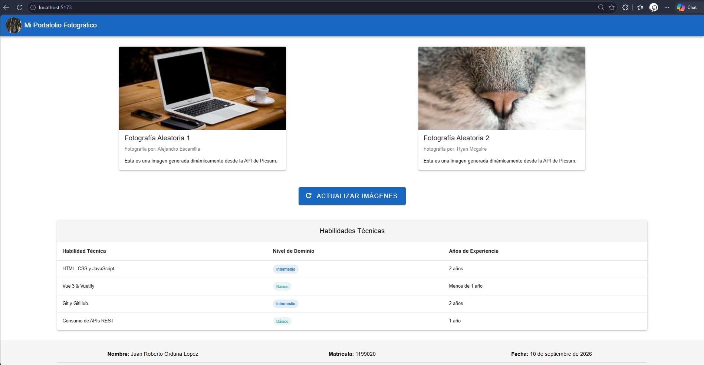

# Portafolio Universitario - Vue 3 & Vuetify

Este es un proyecto escolar de nivel universitario correspondiente a la asignatura "Desarrollo de Aplicaciones Web". Consiste en una aplicación web tipo portafolio que consume imágenes dinámicas desde una API pública (Picsum) y muestra el perfil técnico del estudiante.

## Captura de Pantalla
*(Nota: Añadir aquí una captura real de tu proyecto corriendo)*



## Tecnologías Utilizadas
- **Vue 3** (Framework frontend progresivo, usando Composition API)
- **Vuetify 3** (Librería de componentes de UI estilo Material Design)
- **Vite** (Empaquetador y servidor de desarrollo ultrarrápido)
- **Fetch API** (Para consultas HTTP asíncronas)
- **Git** (Control de versiones)

## Instrucciones de Instalación y Ejecución

Sigue estos pasos para poder levantar el entorno en tu computadora:

1. **Abre tu terminal y clona este repositorio.**
2. **Navega a la carpeta del proyecto** e instala las dependencias:
   ```bash
   npm install
   ```
3. **Inicia el servidor de desarrollo local:**
   ```bash
   npm run dev
   ```
4. **Visualiza la aplicación:**
   Abre tu navegador (preferiblemente Google Chrome o Firefox) y accede al enlace local que arroja la terminal (por defecto, suele ser `http://localhost:5173/`).

## Estructura del Proyecto

El código está organizado de la siguiente manera:

```text
proyecto/
├── public/                # Archivos estáticos
├── src/
│   ├── components/        # Componentes reutilizables de UI
│   │   ├── AppHeader.vue
│   │   ├── AppFooter.vue
│   │   ├── TarjetaConImagen.vue
│   │   └── TablaDeDatos.vue
│   ├── pages/             # Vistas de la aplicación
│   │   └── index.vue      # Vista principal que hace la consulta a la API
│   ├── plugins/
│   │   └── vuetify.js     # Configuración de Vuetify
│   ├── App.vue            # Componente raíz
│   └── main.js            # Punto de inicio (entry point)
├── .gitignore
├── index.html
├── package.json
├── vite.config.js
└── README.md
```

## Características Técnicas Implementadas
- Consumo asíncrono usando `async/await`.
- Manejo de estado de carga con la propiedad `:loading` en el botón.
- Prevención de peticiones duplicadas usando `:disabled`.
- Manejo de errores con `<v-alert>` en caso de que la API falle.
- Sistema de columnas (Grid) de Vuetify (`v-row`, `v-col`) para garantizar diseño responsivo.
